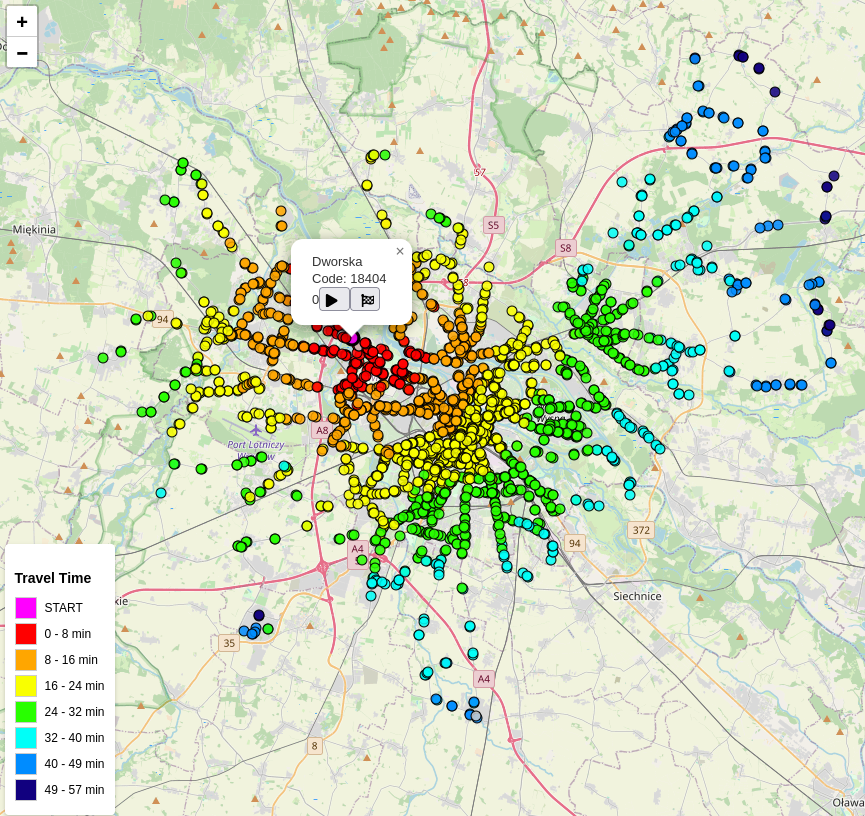
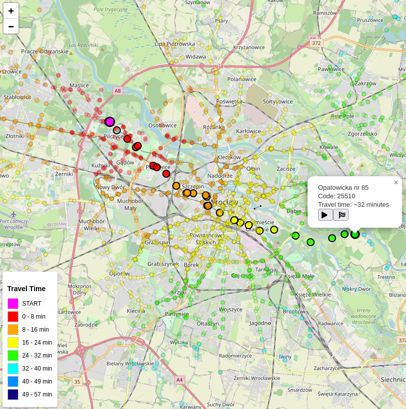

[](https://github.com/sunba23/mpk-isochrone/actions/workflows/build_and_push.yml)
[](https://github.com/sunba23/mpk-isochrone/commits/master)
[](https://github.com/sunba23/sunba.dev/blob/master/LICENSE)

# Wrocław public transport isochrone/travel visualizer

This is a website for generating isochrone maps based on city of Wrocław's public transport schedules. Isochrone map can be generated for any of the 2200 stops. It also allows for checking precise travel time and stops needed to visit in order to get from any stop A to any stop B. Check it out: https://city.sunba.dev:7443/

## Tech Stack


## Preview




## How?

Thanks to [Otwarte Dane Wrocław](https://opendata.cui.wroclaw.pl/), there is a [GTFS-compatible Wrocław Public Transport Schedules Dataset](https://opendata.cui.wroclaw.pl/dataset/rozkladjazdytransportupublicznegoplik_data).
Using my [gtfs_importer](gtfs_importer/) package, which calls [gtfs-via-postgres](https://github.com/public-transport/gtfs-via-postgres), that data is imported to the database.

For the sake of simplicity and performance, travel times should be precomputed. This is done using my [traveltime_precomp](traveltime_precomp/) package - it uses pgRouting's pgr_dijkstra.

## Development

1. Clone the repo:

```bash
git clone https://github.com/sunba23/mpk-isochrone && cd mpk-isochrone
```

2. Enable postGIS and pgRouting in your postgres db. Use [gtfs_importer](gtfs_importer/) to import data to it and [traveltime_precomp](traveltime_precomp/) to pre-compile travel times.
3. Create `.env` file in the project root, containing variables:

```
PG_HOST
PG_DBNAME
PG_USER
PG_PASSWORD
REDIS_PASSWORD
```

3. run the containers with `docker compose up -d`

## License
This project is licensed under the MIT/X11 License - see the [LICENSE](LICENSE) file for details.
